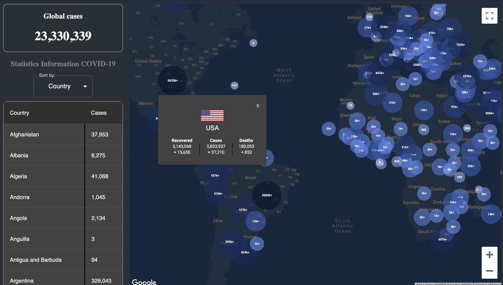

This project was bootstrapped with [Create React App](https://github.com/facebook/create-react-app).

## Covid-19 Statistics

This is an app built by Typescript. It shows Covid-19 statistics on the map and helps the user easier see where is have many cases and lesser cases by different size and color markers on the map. The data of countries also displayed by the list table and are sorted from hight to low by cases, deaths, recovers.

[See app](https://covid19statistic.herokuapp.com)

